<div align="center">

```
██╗  ██╗███████╗██╗      █████╗ ███╗   ██╗███████╗██╗   ██╗
██║  ██║██╔════╝██║     ██╔══██╗████╗  ██║██╔════╝╚██╗ ██╔╝
███████║█████╗  ██║     ███████║██╔██╗ ██║█████╗   ╚████╔╝ 
██╔══██║██╔══╝  ██║     ██╔══██║██║╚██╗██║██╔══╝    ╚██╔╝  
██║  ██║███████╗███████╗██║  ██║██║ ╚████║███████╗   ██║   
╚═╝  ╚═╝╚══════╝╚══════╝╚═╝  ╚═╝╚═╝  ╚═══╝╚══════╝   ╚═╝   
```


<br/>

[](https://helaney.ru)
[](https://discord.gg/qpDeK6juVN)
[](https://github.com/hhelaneyy?tab=followers)

</div>

---

## `> whoami`

```python
class Helaney:
    name       = "Helaney"
    username   = "hhelaneyy"
    location   = "🇷🇺 Russian Federation"
    org        = "Helanova Team"
    bio        = "🦍 бутерброды"
    
    learning   = ["Python", "C#", "C++"]
    interests  = ["Systems Programming", "Fullstack", "Tools & Utilities"]
    
    contact    = {
        "discord": ".helaney",
        "web":     "helaney.ru",
        "server":  "discord.gg/qpDeK6juVN"
    }

    def say_hi(self):
        print("Thanks for visiting! ⚡")
```

---

## `> tech_stack --list`

<div align="center">


</div>

---

## `> git stats --user hhelaneyy`

<div align="center">




<br/>

[](https://github.com/hhelaneyy)

</div>

---

## `> cat activity.log`

<div align="center">

[](https://github.com/hhelaneyy)

</div>

---

<div align="center">

```
╔══════════════════════════════════════════╗
║   🦍  Helaney  ·  @hhelaneyy  ·  🥪    ║
║        helaney.ru · Helanova Team        ║
╚══════════════════════════════════════════╝
```


</div>
